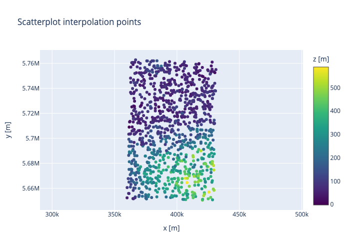
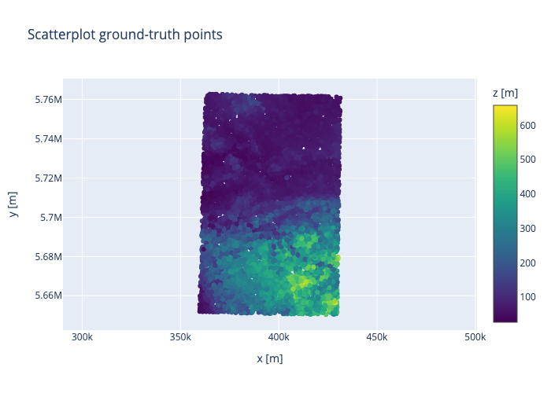
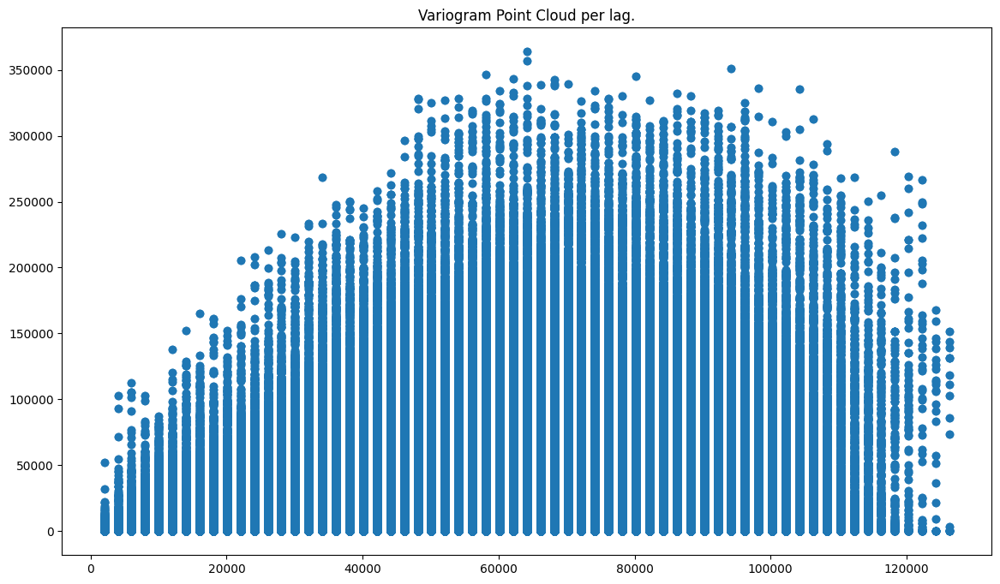
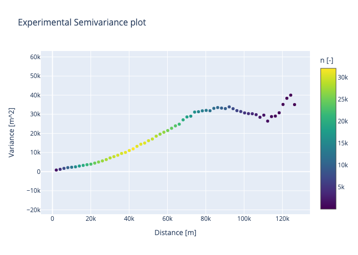
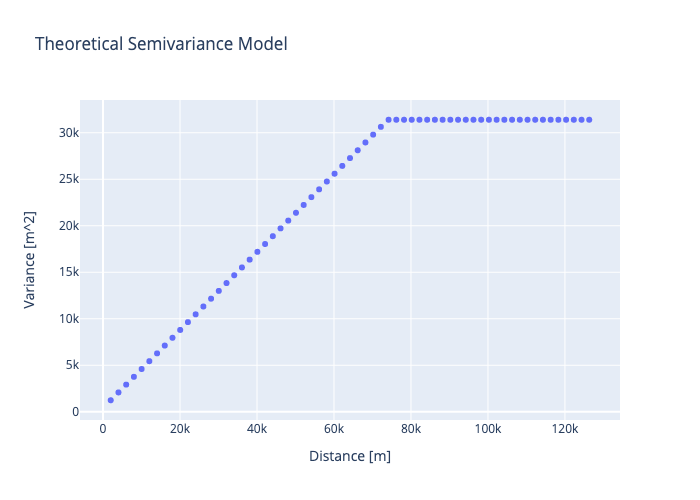
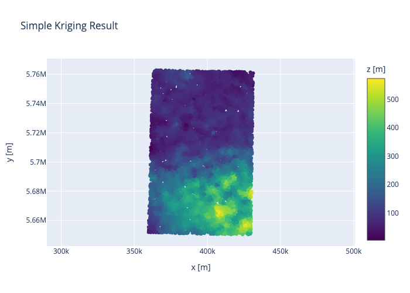
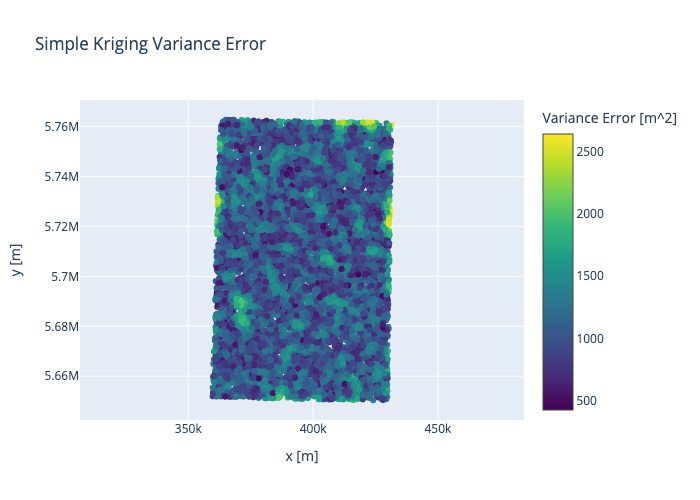
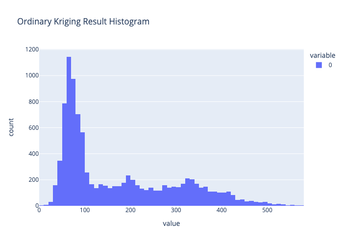
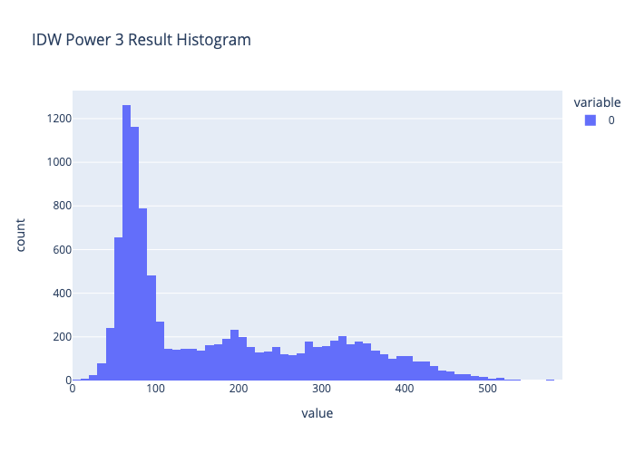

# Report Assignment 03 - Kriging interpolation

- my_code_hw03.ipynb
- hw03 GEO1015.2022
- [Malte Schade]
[5850282]

## Global Parameters

Numpy RNG Seed = 12345678

SRTM Tile = N51E007

Projection = UTM zone 32N (EPSG:32632)

## Reprojection of chosen tile

The srtm dataset is reprojected with rasterio in memory to the destination reference system. The metadata is updated.

```python
def reproject_dataset(src, dst_crs):
    # Calculate transformation parameters
    transform, width, height = calculate_default_transform(
        src.crs, dst_crs, src.width, src.height, *src.bounds)
    
    kwargs = src.meta.copy()
    kwargs.update({
        'driver': 'GTiff',
        'crs': dst_crs,
        'transform': transform,
        'width': width,
        'height': height
    })

    with MemoryFile() as memfile:
        with memfile.open(**kwargs) as dst:
            reproject(
                source=rasterio.band(src, 1),
                destination=rasterio.band(dst, 1),
                src_transform=src.transform,
                src_crs=src.crs,
                dst_transform=transform,
                dst_crs=dst_crs
                )
            
        return memfile.open()
```

## Creation of the 1000 data points with random noise

1000 interpolation points of the dataset are randomly selected and a normal noise function is applied along each dimension in accordanace to specified standard deviations. Before selection nodata values are filtered. Replace=False ensures that there are no duplicate values.

```python
def add_noise(data, std_x, std_y, std_z):
    # Generate normal noise for each dimension
    noise_x = np.random.normal(0, std_x, data.shape[0])
    noise_y = np.random.normal(0, std_y, data.shape[0])
    noise_z = np.random.normal(0, std_z, data.shape[0])
    
    # Add noise to data
    data[:,0] += noise_x
    data[:,1] += noise_y
    data[:,2] += noise_z
    
    return data

# Select all used points (no duplicates)
p_r = p_data[np.random.choice(p_data.shape[0], n_gt+n_in, replace=False)]

# Select interpolation points
p_in = p_r[:n_in]

# Apply normal noise to interpolation points
p_in = add_noise(p_in, *norm_std)
```


*Fig.1: Scatterplot that shows the location of the randomly selected interpolation points. It is clearly visible that the elevation distribution is non uniform in the area.*

## Creation of the 10000 ground truth points

10000 ground truth points are randomly selected.

```python
# Select ground-truth points
p_gt = p_r[n_in:]
```


*Fig.2: Scatterplot that shows the location of the randomly selected ground-truth points. Structures are visible in the area.*

## Variogram cloud

Variogram cloud is created and saved.

```python
# Calculate variogram cloud (Time Intensive!)
vc_in = VariogramCloud(input_array=p_in, step_size=np.max(d_in)/vc_lag, max_range=np.max(d_in))

vc_in.plot()
```


*Fig.3: Variogram Point cloud that shows a trend between variance and distance until a cap is reached (sill).*

## Experimental variogram

Experimental semivariance plot is created and saved.

```python
# Calculate experimental variogram
ev_in = ExperimentalVariogram(input_array=p_in, step_size=np.max(d_in)/vc_lag, max_range=np.max(d_in))
```


*Fig.4: Experimental Semivariance plot that shows a trend between variance and distance more distinc than the point cloud. It can be used to define the hyperparameters of the theoretical model (sill, rang, nugget). The samples in each lag are unequally distributed.*

## Theoretical variogram function

A theoretical variogram model is calculated. The hyperparameters (sill, rang, nugget) are read from the experimental semivariance plot. The used model is 'linear'. It shows the closest representation of the experimental semivariance, although still with substencial error.

```python
# fit theoretical variogram to variance data
tv_in = TheoreticalVariogram()
fitted = tv_in.autofit(ev_in, sill=sill, rang=rang, nugget=nugget, model_types=model)
```


*Fig.5: Theoretical Semivariance model. You can clearly see the sill and rang. The model is linear.*

## Simple kriging results

The simple kriging mean is assumed to be the mean of the z-values of the dataset. The hyperparameters
(neighbor number / neighbor range) are iteratively determined.

```python
# simple kriging
sk = kriging(p_in, tv_in, p_new, how='sk', sk_mean=p_gt[:,2].mean(), no_neighbors=nn, neighbors_range=nr)
```

Results:

R2 = 0.9299

RMSE = 34.58m


*Fig.6: Simple Kriging Result Histogram.*


*Fig.7: Simple Kriging Result.*


*Fig.8: Simple Kriging Variance Error.*

## Ordinary kriging results

The hyperparameters
(neighbor number / neighbor range) are iteratively determined.

```python
# ordinary kriging
ok = kriging(p_in, tv_in, p_new, how='ok', no_neighbors=nn, neighbors_range=nr)
```

Results:

R2 = 0.9317

RMSE = 34.12m


*Fig.9: Ordinary Kriging Result Histogram.*


*Fig.10: Ordinary Kriging Result.*


*Fig.11: Ordinary Kriging Variance Error.*

## IDW results

The hyperparameter (power) is determined iteratively.

```python
# inverse distance power
idw = np.zeros((p_new.__len__(), 3))
idw[:,[0,1]] = p_new
idw[:, 2] = [inverse_distance_weighting(p_in, p_n, power=power) for p_n in p_new]
```

Results:

R2 = 0.9295

RMSE = 34.67m


*Fig.12: IDW Result Histogram.*


*Fig.13: IDW Result.*

## Comparison and analysis of results

### IDW - SK

$\Delta$R2 = 0.9299 - 0.9295 = 0.0004

$\Delta$RMSE =  34.58m - 34.67m = -0.09m

### IDW - OK

$\Delta$R2 = 0.9317 - 0.9295 = 0.0022

$\Delta$RMSE = 34.12m - 34.67m = -0.55m

### SK - OK

$\Delta$R2 = 0.9317 - 0.9299 = 0.0018

$\Delta$RMSE = 34.12m - 34.58m = -0.46m

## Discussion

We see that kriging gives better interpolation of height values in the selected region than IDW. However the gain is not substential in case of simple kriging and in the margin of error. Ordinary kriging however lowers the connected error substencially and is clearly the better suited method for the choosen area. IDW has however the advantage that it is far less computationally demanding. It can therefore be used for very large datasets, where kriging is not viable. The assumptions necessary for simple kriging are not correct for the chosen area. There is a clear height trend in the area, that is not represantable by simple kriging. This is a major limitation of the method.

A possible root of the error of the kriging methods is the, in comparison to the experimental variance, not properly fitted model. Pyinterpolate gives only limited flexibility in model selection and the selected region shows no variance-distance relationship that is propperly representable with the given models.
